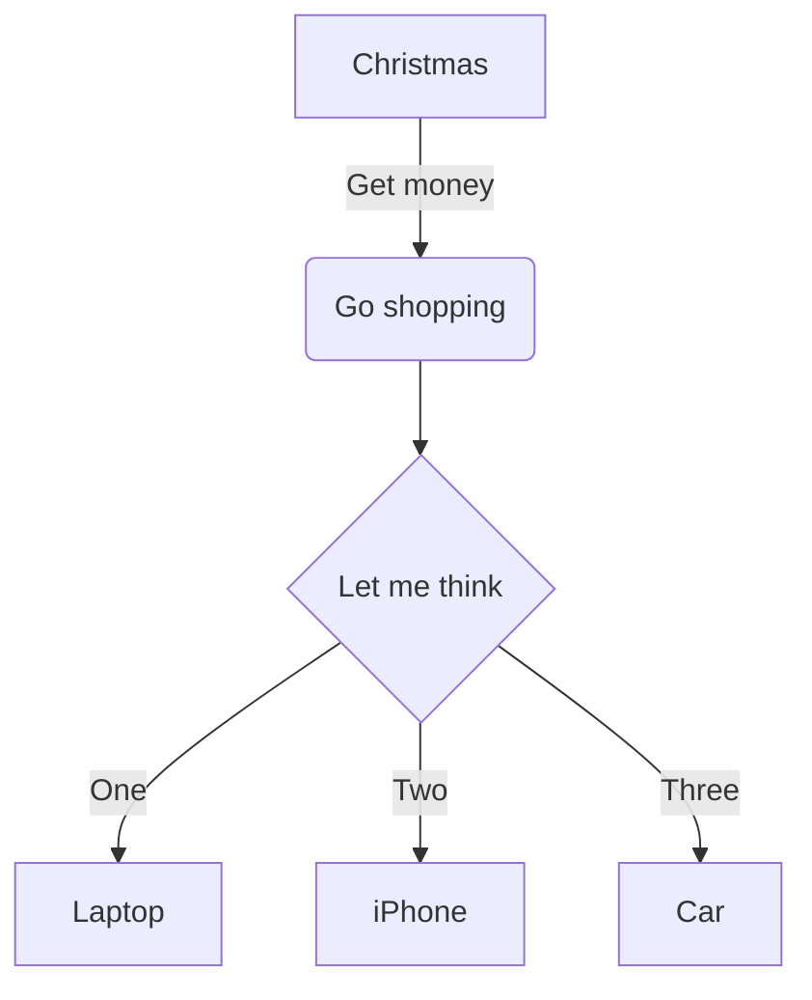

[TOC]

<!-- note that this page uses zero width spaces to display shortcodes in codeblocks -->

## Light & Dark mode

This theme is based on [Halcyon](https://halcyon-theme.netlify.app/), which is originally a color scheme for dark mode only. I've now create a light mode as well, and you can switch between light and dark mode by setting the classes `.dark` or `.light` on the `body` of the document. See the `static/src/theme-toggle.js` file how we do this.

## Table of contents

This page uses `[TOC]` to include a table of contents.
~~You can also use the `toc` shortcode.~~
**Shortcode does not work**

The assumption is that each page has a single TOC, but as you can see writing it multiple times doesn't break things -- only the first one gets rendered.

## Math with MathJax

We support client side rendering of math using MathJax version 4.
You can use both inline math or display math, both supporting \$ notation and a shortcode.

Inline math is done as `$f(x) = x^2$` (rendered as $f(x) = x^2$) using the \$ notation, or as `{​% math() %​}f(x)=x^2{​% end %​}` (rendered as f(x)=x^2) using the shortcode. These should be identical. If they're not, something is horribly broken.

For display math, use `$$...$$`, or explicitly set the shortcode to non-inline mode (`i=false` or `inline=false`). For example, `$$ f(x) = x^2 $$` becomes the block below.

$$ f(x) = x^2 $$

Similarly, with the shortcode `{​% math(i=false) %​}f(x)=x^2{​% end %​}` becomes the block below.

 f(x) = x^2 

These two should render identically.

> Note that newlines are allowed in both, the blocks below are perfectly valid as well.
>
> ```md
> $$
> f(x) = x^2
> $$
> ```
>
> and
>
> ```md
> {​% math(i=false) %​}
> f(x)=x^2
> {​% end %​}
> ```

## Diagrams with Mermaid

We provide Mermaid diagram support via either a normal markdown codeblock or a shortcode.
The diagrams are shown in light/dark theme automatically.

Codeblock source (replace `~` with <code>`</code>)

```md
~~~mermaid
flowchart TD
    A[Christmas] -->|Get money| B(Go shopping)
    B --> C{Let me think}
    C -->|One| D[Laptop]
    C -->|Two| E[iPhone]
    C -->|Three| F[Car]
~~~
```

renders as:



Shortcode source:

```text
{​% mermaid() %​}
flowchart TD
    A[Christmas] -->|Get money| B(Go shopping)
    B --> C{Let me think}
    C -->|One| D[Laptop]
    C -->|Two| E[iPhone]
    C -->|Three| F[Car]
{​% end %​}
```

renders as:


flowchart TD
    A[Christmas] -->|Get money| B(Go shopping)
    B --> C{Let me think}
    C -->|One| D[Laptop]
    C -->|Two| E[iPhone]
    C -->|Three| F[Car]


## Lucide icons

This is mostly a gimmick, and I don't think you'll want to use it, BUT!
The theme provides an `icon` shortcode. This can be used as follows:

1. Without arguments: `{​% icon() %​}menu{​% end %​}` becomes menu.
2. Give it a color: `{​% icon(color="#f59e0b") %​}menu{​% end %​}` becomes menu.
3. Use less verbose arguments: `{​% icon(c="#f59e0b") %​}menu{​% end %​}` becomes menu.
