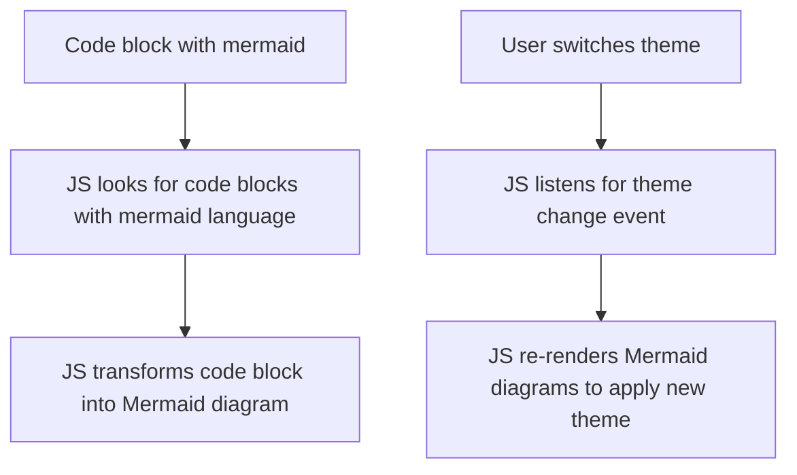

Halcyon has built-in support for Mermaid, which allows you to include diagrams in your content using Mermaid syntax. This is yet another feature to get parity with Obsidian.

## The Bad

Like [[features/mathjax|mathjax]], Zola does not have support for MathJax on _generation_ side of things. So we have the same choice to either "patch" the HTML directly, or write some sort of preprocessor that is completely separate from the `zola` binary.

Even _if_ Zola did have support for Mermaid, Mermaid itself doesn't have support for dark-light theming, so we'd still have to do some effort to make things work.

## The Bug!

Right now, there's a slight issue with how things work (see below). Because mermaid has no notions of theme switching on-the-fly, by switching themes we have to rerender the entire diagram, which resets the scroll position. This is a known issue, and should be fixed in a future release of the Halcyon theme.

## The .. yeah, no word starting with B here

Including Mermaid is done with a script tag in the `<head>`, and then we have an accompanying script that looks for code blocks with `mermaid` as the language, and transforms them into Mermaid diagrams. Because of the aforementioned issue with theme switching, we also have to listen for theme changes, and re-render the diagrams when that happens.



The above diagram is made using following mermaid codeblock:

```text
graph TD
    A[Code block with mermaid] --> B[JS looks for code blocks with mermaid language]
    B --> C[JS transforms code block into Mermaid diagram]
    D[User switches theme] --> E[JS listens for theme change event]
    E --> F[JS re-renders Mermaid diagrams to apply new theme]
```